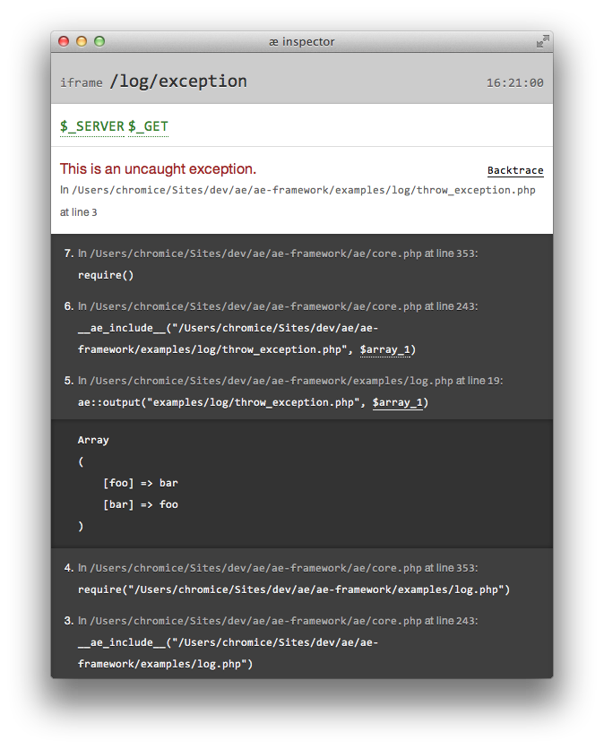
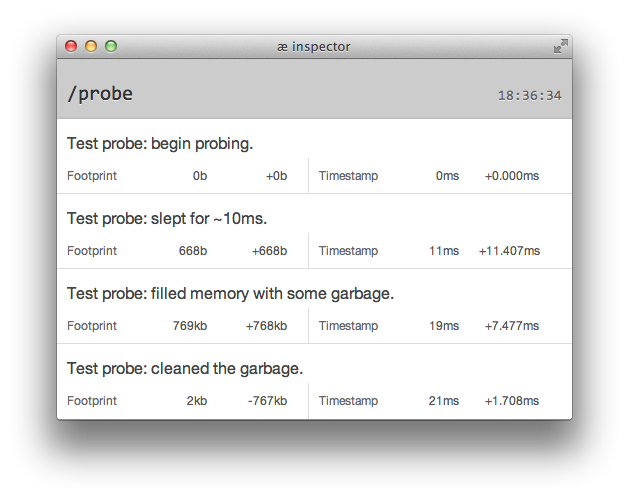

# æ

æ |aʃ| is a low-level web framework written in PHP with a simple goal in mind: *Make a framework that does as little as possible,  but not less*. The actual code base is minuscule and only what you are actively using is loaded and being kept in memory.

It requires PHP version 5.4 or higher, and a recent version of MySQL and Apache with mod_rewrite.

**Please note**: This documentation covers only the basics. I would advise you to read the source code, because this is the best way to familiarise yourself with the API. And in case you miss the software licence at the bottom, *I bare absolutely no responsibility for any bugs I haven't yet squashed*.

- [Getting started](#getting-started)
- [Core](#core)
	- [Importing code](#importing-code)
	- [Running code](#running-code)
	- [Loading libraries](#loading-libraries)
- [Buffer](#buffer)
- [Container](#container)
- [Options](#options)
- [Request](#request)
	- [Request routing](#request-routing)
- [Response](#response)
	- [Response caching](#response-caching)
- [Image](#image)
	- [Image caching](#image-caching)
- [Form](#form)
	- [Field types](#field-types)
	- [Validation](#validation)
- [Database](#database)
	- [Making queries](#making-queries)
	- [Transactions](#transactions)
	- [Retrieving data](#retrieving-data)
	- [Active record](#active-record)
	- [Relationships](#relationships)
- [Inspector](#inspector)
	- [Log](#log)
	- [Probe](#probe)
- [Acknowledgments](#acknowledgments)


## Getting started

Here is a very a simple æ application:

```php
<?php
	include 'ae/core.php';
	
	echo 'Hello ' . ae::request()->segment(0, "world") . '!';
?>
```

You should put this code into *index.php* in the root web directory. */ae* directory containing the core and all libraries should be placed there as well. For the request library to work properly you need to instruct Apache to redirect all unresolved URIs to *index.php*, by adding the following rules to *.htaccess* file:

```apache
<IfModule mod_rewrite.c>
	RewriteEngine on
	RewriteBase /

	RewriteCond %{REQUEST_FILENAME} !-f
	RewriteCond %{REQUEST_FILENAME} !-d
	RewriteRule ^(.*) index.php?/$1 [L,QSA]
</IfModule>
```

Let's assume the address of this app is *http://localhost/*. If you enter that into the address bar of your web browser, you should see this:

```markdown
Hello world!
```

If you change the address to *http://localhost/universe*, you should see:

```markdown
Hello universe!
```

Congratulations! You may tinker with the examples (see */examples* directory) or read the rest of this document to get a basic understanding of æ capabilities.


## Core

In order to start using æ in your application, you must include *core.php* located in the */ae* directory:

```php
include 'ae/core.php';
```

This will import the `ae` class. Its sole purpose is to manage code: import classes, run scripts and capture their output, and load libraries and utilities. All these methods accept both absolute and relative file paths.


### Importing code

You can use `ae::import()` method to include any PHP script:

```php
ae::import('path/to/library.php'); 
```

æ will resolve the path and include the script, if it has not been included yet.


### Running code

`ae::render()` returns output of any script as a string:

```php
$output = ae::render('your/page.php', array(
	'title' => 'Example!',
	'body' => '<h1>Hello world!</h1>'
));
```

Provided the content of */your/page.php* is:

```php
<title><?= $title ?></title><body><?= $body ?></body>
```

The `$output` variable would contain:

```html
<title>Example!</title><body><h1>Hello world!</h1></body>
```

In order to echo the output of a script, you can use `ae::output()` method:

```php
ae::output('your/page.php', array(
	'title' => 'Example!',
	'body' => '<h1>Hello world!</h1>'
));
```


### Loading libraries

In order to load a library you must use `ae::load()` method:

```php
$options = ae::load('ae/options.php');
```

Which is the same as:

```php
ae::import('ae/options.php');
$options = new aeOptions();
```

You can configure the library by passing more arguments to `ae::load()`. æ will pass them to class constructor or object factory by value:

```php
$lib_options = ae::load('ae/options.php', 'my_library_namespace');
```

That would be identical to:

```php
ae::import('ae/options.php');
$lib_options = new aeOptions('my_library_namespace');
```

All libraries located in *ae/* directory (either root or utility directory), can be loaded using a shorthand syntax, e.g.:

```php
$lib_options = ae::options('my_library_namespace');
```

In this case the library name is determined by the name of the method.

æ does not "automagically" guess what class to use, when you are using `ae::load()` method. Instead, you must use `ae::invoke()` method at the beginning of the loaded file to tell æ how you want to invoke a new instance.

In order to create a new instance of `LibraryClassName`, every time the library is loaded, you should pass the class name as the first argument:

```php
ae::invoke('LibraryClassName');

class LibraryClassName
{
	function __construct($argument_1, $argument_2, /*...*/)
	{
		// ...
	}
}
```

You can also use the factory pattern and delegate the creation of the instance by passing a function name, callback or closure:

```php
ae::invoke('a_factory_function');

function a_factory_function($argument_1, $argument_2, /*...*/)
{
	// ...
}
```

Please consult with the source code of the core libraries for real life examples.


## Buffer

`aeBuffer` is a core class used for capturing output.

You must create a buffer and assign it to a variable, in order to start capturing output:

```php
$buffer = new aeBuffer();
```

All output is captured until you  either call `aeBuffer::output()` method to echo its content or `aeBuffer::render()` method to return its content as a string. If you do not use these methods, buffer's content will be flushed when the instance is destroyed. You can prevent autoflushing by using `aeBlackhole` class instead:

```php
$auto_cleaned_buffer = new aeBlackhole();
```

Buffers can also be used as templates, e.g. when mixing HTML and PHP code:

```html
<?php $buffer = new aeBuffer() ?>
<p><a href="{url}">{name}</a> has been viewed {visits} times.</p>
<?php $buffer->output(array(
	'url' => $article->url,
	'name' => (strlen($article->name) > 20 ? substr($article->name, 0, 19) . '&hellip;' : $article->name),
	'visits' => number_format($article->visits)
)) ?>
```


## Container

Container library allows you to wrap output of a script with the output of another script. The container script is executed *after* the contained script, thus avoiding many problems of using separate header and footer scripts to keep the template code [DRY](http://en.wikipedia.org/wiki/DRY).

Here's an example of HTML container, e.g. *container_html.php*:

```html
<html>
<head>
	<title><?= $title ?></title>
</head>
<body>
	<?= $content ?>
</body>
</html>
```

Another script (e.g. *hellow_world.php*) can use it like this:

```php
<?php 
$container = ae::container('path/to/container_html.php')
	->set('title', 'Container example');
?>
<h1>Hello World!</h1>
```

When rendered, it will produce this:

```html
<html>
<head>
	<title>Container example</title>
</head>
<body>
	<h1>Hello World!</h1>
</body>
</html>
```


## Options

Options library is used by many core libraries and allows you to change their behaviour. Options for each library are contained in a separate name space. In order to set or get option value, you must load options library for that namespace:

```php
$options = ae::options('namespace');
```

For example, if your app is sitting behind a proxy or load balancer, you must specify their IP addresses using `aeOptions::set()` method for the request library be able to return the correct IP address of the client:

```php
$options = ae::options('ae.request');

$options->set('proxy_ips', '83.14.1.1, 83.14.1.2');
```

Request library will use `aeRequest::get()` method to retrieve the value of that option:

```php
$options = ae::options('ae.request');

$proxies = $options->get('proxy_ips');
```


## Request

Request library allows you to handle both HTTP and command line requests. You can distinguish between different kinds of requests via `aeRequest::cli`, `aeRequest::ajax` and `aeRequest::method` constants:

```php
ae::import('ae/request.php');

if (aeRequest::is_cli)
{
	echo "Hello World!";
}
else if (aeRequest::is_ajax)
{
	echo "{message:'Hello world'}";
}
else
{
	echo "<h1>Hello World!</h1>";
	
	if (aeRequest::method === 'GET')
	{
		echo "<p>Nothing to get.</p>";
	}
	else if (aeRequest::method === 'POST')
	{
		echo "<p>Nothing to post.</p>";
	}
}
```

You can access URI segments using `aeRequest::segment()`  method:

```php
// GET /some/arbitrary/request HTTP/1.1
$request = ae::request();

echo $request->segment(0); // some
echo $request->segment(1); // arbitrary

echo $request->type(); // html
echo $request->segment(99, 'default value'); // default value
```

All requests have a type ("html" by default), which is defined by the *file extension* part of the URI.

```php
// GET /some/arbitrary/request.json HTTP/1.1
$request = ae::request();

echo $request->type(); // json
```

In order to get the IP address of the client, you should use `aeRequest::ip_address()` method. If your app is running behind a reverse-proxy or load balancer, you need to specify their IP addresses via request options:

```php
ae::options('ae.request')->set('proxy_ips', '83.14.1.1, 83.14.1.2');

$client_ip = ae::request()->ip_address();
```


### Request routing

Requests can be re-routed to a specific directory:

```php
// GET /article/123 HTTP/1.1
$request = ae::request();

$route = $request->route('/', 'handlers/');

if (!$route->exists())
{
	header('HTTP/1.1 404 Not Found');
	echo "Page does not exist.";
	exit;
}

$route->follow();
```

Now, if you have a matching request handler in the */handlers* directory (article.php in this case), æ will run it:

```php
// article.php
$request = ae::request();

if (!$request->is_routed())
{
	die('Direct request is not allowed!');
}

// NB! The /article/ part is pushed out because of routing.
$id = $request->segment(0);

echo "Article ID is $id. ";
echo "You can access it at " . aeRequest::uri();
```

You can route different types of requests to different directories:

```php
$route = ae::request()->route(array(
	'/admin' => 'cms/', // all requests starting with /admin 
	'/' => 'webroot/' // other requests
)->follow();
```

You can always provide an anonymous function instead of a directory and pass URI segments as arguments like this:

```php
ae::request()->route(array(
	'/example/{any}/{alpha}/{numeric}' => function ($any, $alpha, $numeric, $etc) {
		echo 'First handler. Request URI: /example/' . $any . '/' . $alpha . '/' . $numeric . '/' . $etc;
	},
	'/' => function($uri) {
		echo 'Default handler. Request URI: /' . $uri;
	}
))->follow();
```


## Response

Response library allows you to create a response of a specific mime-type, set its headers and (optionally) cache and compress it.

Here is an example of a simple application that creates gzip'ed response with a custom header that is cached for 5 minutes:

```php
<?php 
// GET /hello-world HTTP/1.1
include 'ae/core.php';

ae::options('ae.response')
	->set('compress_output', true); // turn on the g-zip compression

$response = ae::response('html')
	->header('X-Header-Example', 'Some value');
?>
<h1>Hello world</h1>
<?php 
$response
	->cache(5, '/hello-world.html') // cache for five minutes as /hello-world.html
	->dispatch(); // dispatch the request
?>
```

You can specify the type when you create a new response object. It should be either a valid mime-type or a shorthand like "html", "css", "javascript", "json", etc. By default all responses are "text/html". When response object is created, it starts capturing all output. You have to call `aeResponse::dispatch()` method to send the response along with any HTTP headers set via `aeResponse::header()` method.


### Response caching

If you want the response to be cached client-side for a number of minutes, use `aeResponse::cache()` method. It will set "Cache-Control", "Last-Modified" and "Expires" headers for you.

Response library supports server-side caching as well. The responses are saved to */cache* directory by default. For caching to work correctly this directory must exist and be writable. You must also configure Apache to look for cached responses in this directory.

Here are the rules that *.htaccess* file in the web root directory must contain:

```apache
<IfModule mod_rewrite.c>
	RewriteEngine on
	RewriteBase /

	# Append ".html", if there is no extension...
	RewriteCond %{REQUEST_FILENAME} !-f
	RewriteCond %{REQUEST_FILENAME} !-d
	RewriteCond %{REQUEST_URI} !\.\w+$
	RewriteRule ^(.*?)$ /$1.html [L]

	# ...and redirect to cache directory ("/cache")
	RewriteCond %{REQUEST_FILENAME} !-f
	RewriteRule ^(.*?)\.(\w+)$ /cache/$1/index.$2/index.$2 [L,ENV=FROM_ROOT:1]
</IfModule>
```

And here's what *.htaccess* file in */cache* directory must be like:

```apache
<IfModule mod_rewrite.c>
	RewriteEngine on

	# If no matching file found, redirect back to index.php
	RewriteCond %{REQUEST_FILENAME} !-f
	RewriteRule ^(.*) /index.php?/$1 [L,QSA]
</IfModule>
```

Apache would first look for a cached response, and only if it finds no valid response, will it route the request to */index.php*. No PHP code is actually involved in serving cached responses.

In order to save a response use `aeResponse::cache()` method, passing the number of minutes it should be cached for via first argument and full request URI (including the file extension) via second argument:

```php
$response->cache(5, '/hello-world.html');
```

You can delete any cached response using `aeResponseCache::delete()` method by passing full or partial URL to it:

```php
ae::import('ae/response.php');

aeResponseCache::delete('/hello-world.html');
```

You should also remove all stale cache entries via `aeResponseCache::collect_garbage()`:

```php
ae::import('ae/response.php');

aeResponseCache::collect_garbage();
```

The garbage collection can be a very resource-intensive operation, so its usage should be restricted to an infrequent cron job.


## Image

Image library is a very light wrapper around standard GD library functions:

```php
$image = ae::image('examples/image/test.jpg');

// Get meta data
$width = $image->width();
$height = $image->height();
$type = $image->type(); // png, jpeg or gif
$mimetype = $image->mimetype();

// Blow one pixel up.
$image
	->crop(1,1)
	->scale($width, null) // scale proportionately.
	->save('tiny_bit.png');

// save() resets state to default, i.e. no crop, scale, prefix, suffix, etc.

// Crop to cover
$image
	->align(aeImage::center, aeImage::middle) // same as align(0.5, 0.5)
	->fill(100, 100)
	->prefix('cropped_')
	->save(); // save as 'cropped_test.jpg'

// Resize to fit (and preserve the result for next operation)
$small = $image
	->fit(320, 320)
	->suffix('_small')
	->save();  // save as 'test_small.jpg'

// Apply colorize filter
// using http://uk3.php.net/manual/en/function.imagefilter.php
$small
	->apply(IMG_FILTER_COLORIZE, 55, 0, 0)
	->dispatch(); // clean all output, set the correct headers, return the image content and... die!
```

### Image caching

Images can be cached just like responses:

```php
$image = ae::image('examples/image/test.jpg');

$image->apply(IMG_FILTER_COLORIZE, 55, 0, 0)
	->cache(aeResponseCache::year, '/images/foo.png') // cache image for a year
```

## Form

Form library allows you to generate form controls, validate submitted values and display error messages.

Each form must have a unique ID. This way the library knows which form has been submitted, even if there are multiple forms on the page.

In general any form script would consist of three parts: form and field declaration, validation and HTML output.

Let's declare a simple form with three fields (text input, checkbox and select drop-down) and basic validation rules:

```php
$form = ae::form('form-id');

$input = $form->single('text')
	->required('This field is required.')
	->min_length('It should be at least 3 characters long.', 3)
	->max_length('Please keep it shorter than 100 characters.', 100);

$checkbox = $form->single('checkbox')
	->required('You must check this checkbox!');

$options = array(
	'foo' => 'Foo',
	'bar' => 'Bar'
);

$select = $this->single('select')
	->valid_value('Wrong value selected.', $options);
```

Now, this declaration is enough to validate the form, has it been submitted:

```php
if ($form->is_submitted())
{
	$is_valid = $form->validate();
	
	if ($is_valid)
	{
		$values = $form->values();
		
		var_dump($values);
	}
}
```

If the form has not been submitted, you may want to populate it with default values:

```php
if (!$form->is_submitted())
{
	$form->value(array(
		'text' => 'Foo'
	));
}
```

The HTML code of the form's content can be anything you like, but you must use `aeForm::open()` and `aeForm::close()` methods instead of `<form>` and `</form>` tags:

```php
<?= $form->open() ?>
<div class="field">
	<label for="<?= $input->id() ?>">Enter some text:</label>
	<?= $input->input('text') ?>
	<?= $input->error() ?>
</div>
<div class="field">
	<label><?= $checkbox->input('checkbox') ?> Check me out!</label>
	<?= $checkbox->error() ?>
</div>
<div class="field">
	<label for="<?= $select->id() ?>">Select something (totally optional):</label>
	<?= $select->select(array('' => 'Nothing selected') + $options) ?>
	<?= $select->error() ?>
</div>
<div class="field">
	<button type="submit">Submit</button>
</div>
<?= $form->close() ?>
```

Most generated form controls will have HTML5 validation attributes set automatically. If you want to turn off HTML5 validation in the browsers that support it, you should set the `novalidate` attribute of the form:

```php
<?= $form->open(array('novalidate' => true)); ?>
```

### Field types

Form library does not distinguish between various input types of HTML when the form is validated, as it operates only with values. However, if a field accepts multiple values (e.g. `<select multiple>`, `<input type="email" multiple>` or several `<input type="checkbox">`) you must declare the field appropriately for validation to work.

In cases where the amount of values is arbitrary you must declare the field as `multiple`:

```php
$cb = $form->multiple('checked')->required('Check at least one box');
```

You would then output this field like this:

```php
<label><?= $cb->input('checkbox', 'foo') ?> Foo</label><br>
<label><?= $cb->input('checkbox', 'bar') ?> Bar</label>
<?= $cb->error('<br><em class="error">','</em>') ?>
```

If you need a sequence of fields with the same validation rules, you should use a `sequence` field of predefined minimum and (optionally) maximum length:

```php
$tags = $form->sequence('tags', 1, 5)
	->min_length('Should be at least 2 character long', 2);
```

The sequence will contain the minimum number of fields required, but you can let user control the length via "Add" and "Remove" buttons.

```php
if ($form->value('add') === 'tag')
{
	$tags[] = ''; // Empty by default
}
else if ($index = $form->value('remove')) // NB! intentionally does not work for 0.
{
	unset($tags[$index]);
}
```

And here is what the HTML of this field will look like:

```php
<?php $count = 0; foreach ($tags as $index => $tag): $count++; ?>
<div class="field">
	<label for="<?= $tag->id() ?>">Tag <?= $index + 1 ?>:</label>
	<?= $tag->input('input') ?>
<?php if ($count > 0): ?>
	<button type="submit" name="remove" value="<?= $tag->index() ?>">Remove</button>
<?php endif ?>
	<?= $tag->error() ?>
</div>
<?php endforeach ?>
<?php if ($tag->count() < 5): ?>
<p><button type="submit" name="add" value="tag">Add another</button> tag.</p>
<?php endif ?>
```

You can combine several sequences in one loop to create repeatable field groups.

### Validation

Form library comes with a few validation methods. Each method accepts validation error message as the first argument.

Any field can be made required:

```php
$field->required('This field is required.');
```

If the value of the field is a decimal/integer number or time/date/month/week, you can validate its format and minimum and maximum value:

```php
$number->valid_pattern('Should contain a number.', aeValidator::integer)
	->min_value('Must be equal to 2 or greater.', 2)
	->max_value('Must be equal to 4 or less.', 4);
$date->valid_pattern('Should contain a date: YYYY-MM-DD.', aeValidator::date)
	->min_value('Cannot be in the past.', date('Y-m-d'));
```

If value is a string you may validate its format and maximum and minimum length:

```php
$field->valid_pattern('This should be a valid email.', aeValidator::email)
	->min_length('Cannot be shorter than 5 characters.', 5)
	->max_length('Cannot be longer than 100 characters.', 100);
```

The library comes with a few format validators:

- `aeValidator::integer` — an integer number, e.g. -1, 0, 1, 2, 999;
- `aeValidator::decimal` — a decimal number, e.g. 0.01, -.02, 25.00, 30;
- `aeValidator::numeric` — a string consisting of numeric characters, e.g. 123, 000;
- `aeValidator::alpha` — a string consisting of alphabetic characters, e.g. abc, cdef;
- `aeValidator::alphanumeric` — a string consisting of both alphabetic and numeric characters, e.g. a0b0c0, 0000, abcde;
- `aeValidator::color` — a hex value of a color, e.g. #fff000, #434343;
- `aeValidator::time` — a valid time, e.g. 14:00:00, 23:59:59.99;
- `aeValidator::date` — a valid date, e.g. 2009-10-15;
- `aeValidator::datetime` — a valid date and time, e.g. 2009-10-15T14:00:00-9:00;
- `aeValidator::month` — a valid month, e.g. 2009-10;
- `aeValidator::week` — a valid week, e.g. 2009-W42;
- `aeValidator::email` — a valid email address;
- `aeValidator::url` — a valid URL string;
- `aeValidator::postcode_uk` — a valid UK postal code.

You may define any other pattern manually:

```php
$field->valid_pattern('At least 5 alphabetic characters.', '[a-zA-Z]{5,}');
```

You can also use an anonymous function as a validator:

```php
$field->valid_value('Devils are not allowed.', function ($value) {
	return $value != 666;
});
```

If you let user choose a value (or multiple values) from a predefined list, you should always validate whether they submitted correct data:

```php
$field->valid_value('Wrong option selected.', array(
	'foo', 'bar' //, '...'
));
```

Legitimate users would never see this error, but it prevents would-be hackers from tempering with the data.


## Database

Database library allows you make MySQL queries and exposes a simple active record style abstraction for tables.

Before you can make queries to the database, you have to specify the connection parameters using the options library:

```php
// Configure the "default" database connection
ae::options('ae.database.default')
	->set('host', 'localhost')
	->set('user', 'root')
	->set('password', 'root')
	->set('database', 'ae');
```

Provided the connection parameters are correct and the database ("ae" in this example) exists, you can create a connection and make a query:

```php
try {
	$db = ae::database(); // same as ae::database("default");
	
	$db->query("SELECT 1")->make();
} catch (aeDatabaseException $e) {
	echo 'Something went wrong: ' . $e->getMessage();
}
```

As you can see, whenever something goes wrong on the database side, the library throws `aeDatabaseException`, which you can catch and handle gracefully.

If you want to know what queries are performed and how much memory and time they take, you can turn query logging on:

```php
ae::options('ae.database')
	->set('log', true);
```

See [Inspector](#inspector) section for more details.

### Making queries 

Let's create the "authors" table:

```php
ae::database()
	->query("CREATE TABLE IF NOT EXISTS {table} (
		`id` int(10) unsigned NOT NULL AUTO_INCREMENT,
		`name` varchar(255) NOT NULL,
		`nationality` varchar(255) NOT NULL,
		PRIMARY KEY (`id`)
	) ENGINE=InnoDB DEFAULT CHARSET=utf8")
	->aliases(array(
		'table' => 'authors'
	))
	->make();
```

Instead of specifying the table name in the query itself we are using `{table}` placeholder and specify its value via `aeDatabase::aliases()` method. The library will wrap the name with backticks ("`") and replace the placeholder for us.

While not particularly useful in this example, placeholders are generally a good way to keep you query code readable.

Let's fill this table with some data:

```php
ae::database()
	->query("INSERT INTO {table} ({data:names}) VALUES ({data:values})")
	->aliases(array(
		'table' => 'authors'
	))
	->data(array(
		'name' => 'Richar K. Morgan', // (sic)
		'nationality' => 'British'
	))
	->make();

$morgan_id = ae::database()->insert_id();
```

In this example we are using `{data:names}` and `{data:values}` placeholders and specify column names and corresponding values via `aeDatabase::data()` method. Now, I intentionally made a typo in the authors name, so let's fix it:

```php
ae::database()
	->query("UPDATE {table} SET {data:set} WHERE `id` = {author_id}")
	->aliases(array(
		'table' => 'authors'
	))
	->data(array(
		'name' => 'REPLACE(`name`, "Richar ", "Richard ")'
	), aeDatabase::statement) // don't escape
	->variables(array(
		'author_id' => $morgan_id
	), aeDatabase::value) // escape
	->make();
```

In this example we are using `{data:set}` placeholder and specifying its value via `aeDatabase::data()` method, while `aeDatabase::variables()` method will escape the value of `$morgan_id` and replace `{author_id}` placeholder. 

Of course, these are just examples, there is actually a less verbose way to insert and update rows:

```php
ae::database()->update('authors', array(
	'nationality' => 'English'
), array('id' => $morgan_id));
$stephenson_id = ae::database()->insert('authors', array(
	'name' => 'Neal Stephenson',
	'nationality' => 'American'
)); 
$gibson_id = ae::database()->insert('authors', array(
	'name' => 'William Ford Gibson',
	'nationality' => 'Canadian'
));
```

> There is also `aeDatabase::insert_or_update()` method, which you can use to update a row or insert a new one, if it does not exist; `aeDatabase::count()` for counting rows; `aeDatabase::find()` for retrieving a particular row; and `aeDatabase::delete()` for deleting rows from a table. Please consult the source code of the database library to learn more about them.

### Transactions

A sequence of dependant database queries must always be wrapped in a transaction to prevent race condition and ensure data integrity:

```php
// Open transaction
$transaction = ae::database()->transaction();

// ...perform a series of queries...

$transaction->commit();

// ...perform another series of queries...

$transaction->commit();

// Close transaction (rolling back any uncommitted queries)
unset($transaction);
```

This way, if one of your SQL queries fails, it will throw an exception and all uncommitted queries will be rolled back, when the `$transaction` object is destroyed.

**NB!** Only one transaction can exist at a time.

### Retrieving data

Now that we have some rows in the table, let's retrieve and display them:

```php
$count = ae::database()->count('authors');
$authors = ae::database()->select('authors')->result();

echo "There are $count authors in the database:\n";

while ($author = $authors->fetch())
{
	echo "- {$author['name']}\n";
}
```

This will produce:

```markdown
There are 3 authors in the database:
- Richard K. Morgan
- Neal Stephenson
- William Ford Gibson
```

Now, let's change the query so that authors are ordered alphabetically:

```php
$authors = ae::database()
	->select('authors') // equivalent to ->query('SELECT * FROM `authors` {sql:join} {sql:where} {sql:group_by} {sql:having} {sql:order_by} {sql:limit}')
	->order_by('`name` ASC')
	->result() // return an instance of aeDatabaseResult
	->all(); // return an array of rows
$count = count($authors);

echo "There are $count authors in the result set:\n";

foreach ($authors as $author)
{
	echo "- {$author['name']}\n";
}
```

Again, instead of specifying `ORDER BY` clause directly in the query we are using a placeholder for it, that will be filled in only if we specify the clause via `aeDatabase::order_by()` method. 

> Database library has other placeholder/method combinations like this: `{sql:join}` / `join()`, `{sql:where}` / `where()`, `{sql:group_by}` / `group_by()`, `{sql:having}` / `having()` and `{sql:limit}` / `limit()`. They allow you to write complex parameterized queries without concatenating all bits of the query yourself. Please consult the source code of the database library to learn more about them.

Note that we are also using `aeDatabaseResult::all()` method to return an array of results, instead of fetching them one by one in a `while` loop. Please note that `aeDatabaseResult::fetch()` method is the most memory efficient way of retrieving results.

The example above will produce a list of authors in alphabetical order:

```markdown
There are 3 authors in the database:
- Neal Stephenson
- Richard K. Morgan
- William Ford Gibson
```

### Active record

Database library has `aeDatabaseTable` abstract class that your table specific class can extend:

```php
class Authors extends aeDatabaseTable {}
```

This one line of code is enough to start performing basic CRUD operations for that table:

```php
// Create an instance of Authors pointed at Neal Stephenson 
// record in the "authors" table:
$stephenson = Authors::find($stephenson_id);

// Load only name and nationality properties
$stephenson->load(array('name', 'nationality'));

echo $stephenson->name; // Neal Stephenson
echo ' -- ';
echo $stephenson->nationality; // American
```

As you can see, finding a record does not actually load its data. In some cases you may  want to update some property of an existing record without loading its data:

```php
// Let's change William Gibson's nationality
$gibson = Authors::find($gibson_id);

$gibson->nationality = 'American';

// Update the record in the database
$gibson->save();
```

Let's create a new record and save it to the database:

```php
$shaky = Authors::create(array(
	'name' => 'William Shakespeare',
	'nationality' => 'English'
));

// Create a new record in the database
$shaky->save();
```

In order to retrieve several records from the database, you would make a regular query, but instead of calling `aeDatabase::result()` method, you should call `aeDatabaseTable::many()` method with the name of the table class as the first argument:

```php
$authors = ae::database()
	->query('SELECT * FROM `authors`')
	->many('Authors');
$count = $authors->count();

echo "There are $count authors in the database:\n";

while ($author = $authors->fetch())
{
	echo "- {$author->name}\n";
}
```

```markdown
There are 4 authors in the database:
- Richard K. Morgan
- Neal Stephenson
- William Ford Gibson
- William Shakespeare
```

Now, Shakespeare was a playwright, while the rest of the authors are novelists. Let's delete his record:

```php
$shaky->delete();
```

### Relationships

Let's make things more interesting by introducing a new class of objects: books. First, we need to create a table to store them:

```php
ae::database()->query("CREATE TABLE IF NOT EXISTS `books` (
	`id` int(10) unsigned NOT NULL AUTO_INCREMENT,
	`author_id` int(10) unsigned NOT NULL,
	`title` varchar(255) NOT NULL,
	PRIMARY KEY (`id`)
) ENGINE=InnoDB DEFAULT CHARSET=utf8")->make();
```

We also need a class to represent this table. To keep things interesting, we will name it `Novels`. Obviously `aeDatabaseTable` won't be able to guess the name of the table, so we will specify it manually by overriding the `aeDatabaseTable::name()` method:

```php
class Novels extends aeDatabaseTable
{
	public static function name()
	{
		return 'books'; // that is the real name of the table
	}
}
```

> There are several methods you can override like this: `aeDatabaseTable::database()` to return a different database connection object; `aeDatabaseTable::accessor()` to return an array of primary keys; `aeDatabaseTable::columns()` to return an array of data columns.

We could start spawning new books using `Novels::create()` method, like we did with authors, but instead we will incapsulate this functionality into `Authors::add_novel()` method:

```php
class Authors extends aeDatabaseTable
{
	public function add_novel($title)
	{
		$ids = $this->ids();
		
		return Novels::create(array(
			'author_id' => $ids['id'],
			'title' => $title
		))->save();
	}
}
```

Finally, let's add a few books to the database:

```php
$gibson->add_novel('Neuromancer');
$gibson->add_novel('Count Zero');
$gibson->add_novel('Mona Lisa Overdrive');

$stephenson->add_novel('Snow Crash');
$stephenson->add_novel('Cryptonomicon');
$stephenson->add_novel('Reamde');

// Note: we don't have to load author's record to add a novel.
$morgan = Authors::find($morgan_id);

$morgan->add_novel('Altered Carbon');
$morgan->add_novel('Broken Angels');
$morgan->add_novel('Woken Furies');
```

So far so good. Let's add a method to `Novels` class that will return all book records sorted alphabetically:

```php
class Novels extends aeDatabaseTable
{
	public static function name()
	{
		return 'books'; // that is the real name of the table
	}
	
	public static function all()
	{
		return static::database()
			->select(self::name())
			->joining('Authors', 'author')
			->order_by('{table}.`title`')
			->many('Novels');
	}
}
```

Most of this code should be familiar to you. The only novelty is `aeDatabase::joining()` method. The query will retrieve data from both "books" and "authors" tables, and we instruct the database driver to return "books" data as an instance of `Novels` class, and "authors" data as an instance of `Authors` class (first argument) assigned to `author` property (second argument) of the corresponding novel object.

Let's inventory our novel collection:

```php
$novels = Novels::all();
$count = $novels->count();

echo "Here are all $count novels ordered alphabetically:\n";

while ($novel = $novels->fetch())
{
	echo "- {$novel->title} by {$novel->author->name}\n";
}
```

```markdown
Here are all 9 novels ordered alphabetically:
- Altered Carbon by Richard K. Morgan
- Broken Angels by Richard K. Morgan
- Count Zero by William Ford Gibson
- Cryptonomicon by Neal Stephenson
- Neuromancer by William Ford Gibson
- Mona Lisa Overdrive by William Ford Gibson
- Reamde by Neal Stephenson
- Snow Crash by Neal Stephenson
- Woken Furies by Richard K. Morgan
```

## Inspector

Inspector utility allows you to debug and profile your application more easily. It comes with two libraries: "Log" and "Probe".

### Log

Log library allows you to log events and dump variables for quick and easy debugging. It also automatically captures all uncaught exceptions, as well as all errors and notices. On shutdown, it appends the log as HTML comment to the output sent to the browser, or pipes it to standard error output in [CLI mode](http://php.net/manual/en/features.commandline.php). Optionally, the log can be appended to a file in a user-defined directory.

**NB!** The parsing errors and anything that impedes PHP execution in a horrible manner will prevent log library to handle the error. This is a limitation of PHP.

Here's a short example of how the library should be used:

```php
// You must load the inspector utility
ae::register('utilities/inspector');

// Put all logs to /log directory (if it is writable)
ae::options('inspector')->set('directory_path', '/log');

// Trigger an error artificially.
trigger_error("Everything goes according to the plan.", E_USER_ERROR);

// You can log a message and dump a variable
ae::log("Let's dump something:", $_SERVER);
```

In the context of a web site or application, æ appends the log to the output only if the client IP address is in the white list, which by default contains only 127.0.0.1, a.k.a. localhost.

```php
ae::options('inspector')->set('allowed_ips', '127.0.0.1, 192.168.1.101');
```

You can also automatically dump the environment variables and local variable scopes for errors:

```php
ae::options('inspector')->set('dump_context', true);
```

If the request has `X-Requested-With` header  set to `XMLHTTPRequest` (colloquially referred to as AJAX), instead of appending the log to the body of the response, æ will encode it into base64 and send it back via `X-ae-log` header of the response.

æ comes with a small HTML application called **Inspector**. It allows you to browse all logs generated for the current page, including iFrames or AJAX requests. The log library will inject the inspector button into the page, if there are any messages logged. Pressing that button will open a new window, in which you can browse all items, view dumps, backtraces, etc.:




### Probe

Probe library allows you to profile your code and see how much time and memory each part consumes.

```php
// You must load the inspector utility
ae::register('utilities/inspector');

// Create a probe
$probe = ae::probe('Test probe')->mark('begin probing');

usleep(10000);

$probe->mark('slept for ~10ms');

$a = array(); $j = 0; while($j < 10000) $a[] = ++$j;

$probe->mark('filled memory with some garbage');

unset($a);

$probe->mark('cleaned the garbage');
```

If you run this script, the probe will log the following messages:



**NB!** Each logged message itself consumes a few hundred bytes of memory.


## Acknowledgments

This project is born out of love and respect for PHP, a language of insanity, learning which helped me build beautiful things. This work stands on the shoulders of giants:

- Respect to Rick Ellis for CodeIgniter and for shifting the perception of how big the framework should be and what it should do, towards smaller and more focused respectively.

- Hat tip to MODx community. Your template syntax and architecture is even uglier than PHP's, but out of your love for the platform many great ideas were born. A few of those — expressed in slightly better PHP — found new home here; some inspired me to come up with better ones.

- A sly smirk at Wordpress, which I've learned to love to hate as a developer, but respect as a user.
